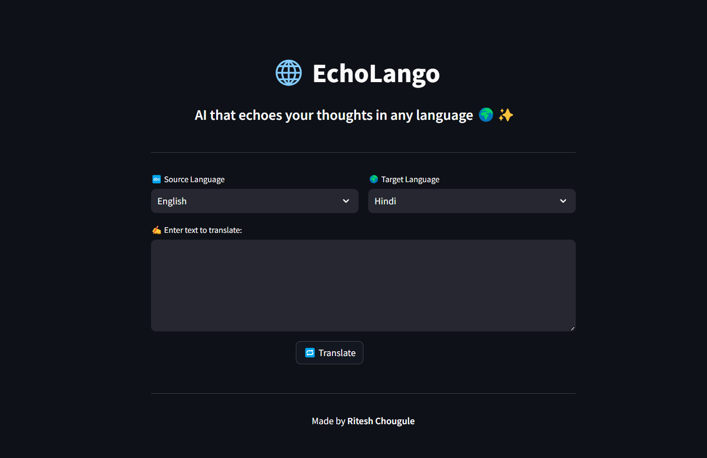
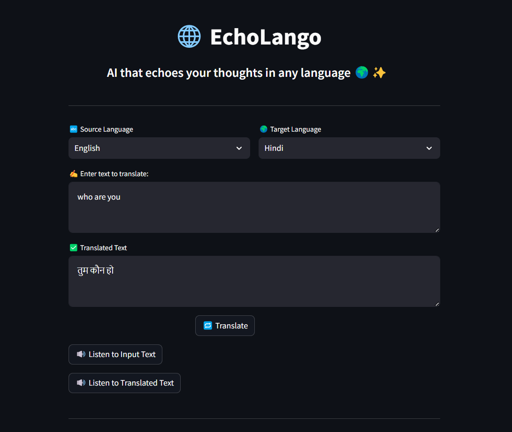

# 🌐 EchoLango - AI Language Translator

**EchoLango** is a multilingual translation web app built with **Streamlit**, powered by **LLaMA 3 via Groq API**, and enhanced with **gTTS** for text-to-speech functionality.

It translates text between various languages and lets users **listen** to both original and translated content.

---

## 🚀 Features

- 🔁 Translate text between multiple languages
- 🧠 Uses **LLaMA 3 (70B)** model for high-quality translations
- 🔊 Listen to original and translated text using **gTTS**
- ⚡ Fast response time using **Groq's inference engine**
- 💻 Minimal and clean Streamlit UI

---

## 🌍 Supported Languages
- English
- Hindi
- Marathi
- Bengali
- Gujarati
- French
- German
- Spanish
- Japanese
- Chinese

---

## 🛠️ Tech Stack

- **Frontend**: Streamlit
- **LLM**: [Groq API](https://console.groq.com/)
- **Translation Logic**: Langchain + LLaMA 3
- **Text-to-Speech**: gTTS
- **Language Detection**: langdetect

---

## 📦 Installation

1. **Clone the repo**:
```bash
git clone https://github.com/RiteshRC96/Language-Translator.git
```

2. **Install dependencies**:
```bash
pip install -r requirements.txt
```

3. **Set up Groq API Key**:
Open `app.py` and set your key:
```python
GROQ_API_KEY = "your_groq_api_key_here"
```

4. **Run the app**:
```bash
streamlit run app.py
```

---

## 📸 Screenshots




---

## ✏️ Usage
EchoLango is your multilingual assistant for:

- 🌍 Language Translation
- 🗣️ Text-to-Speech Playback
- 🧠 AI-Powered Accuracy
- 🧑‍🏫 Learning New Languages
  
---

## 📌 Example
🔸 Input:
- Source Language: English
- Target Language: Hindi
- Text to Translate: Where is the nearest hospital?

🔸 Output:
- Translated Text: सबसे नज़दीकी अस्पताल कहाँ है?

---

## 🙌 Credits
Created by Ritesh Chougule ✨

---

## 📄 License
This project is open-source and available under the [MIT License](LICENSE).


